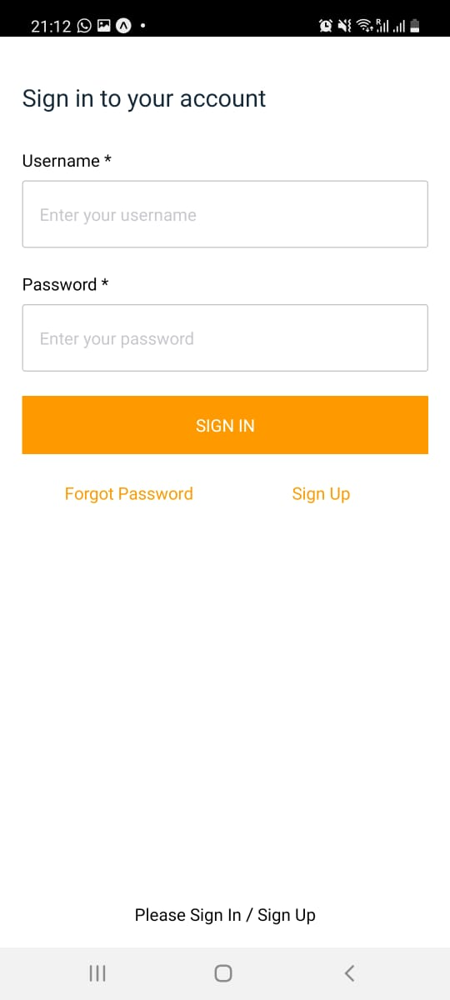
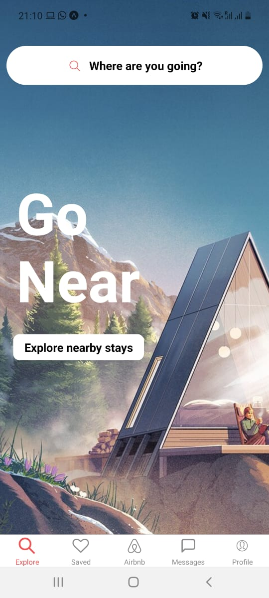
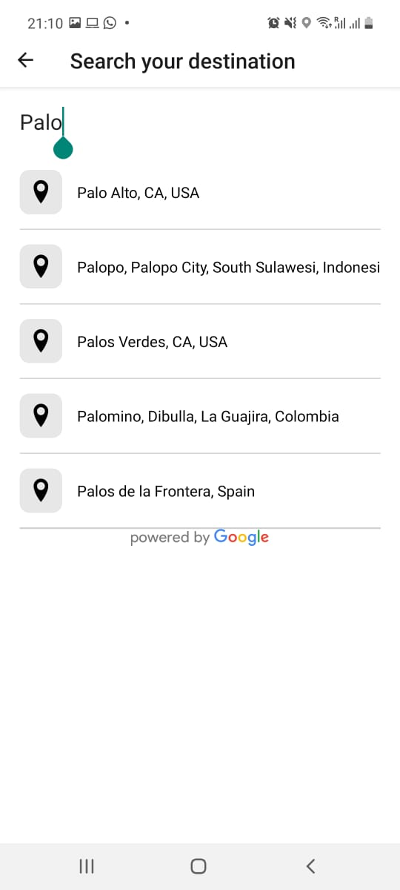
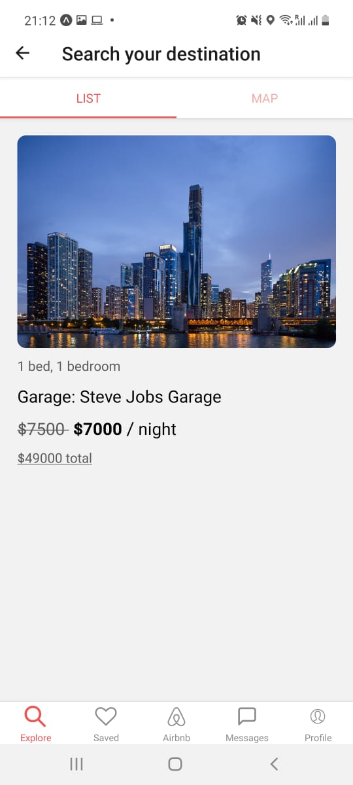
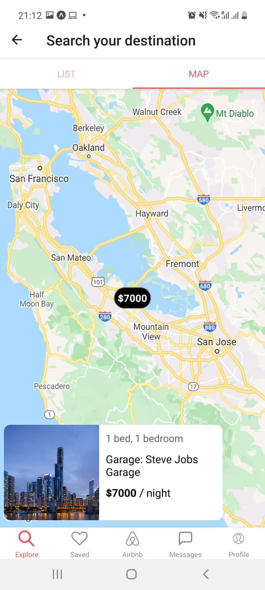

Airbnb clone
===

This project was bootstrapped with React Native + Expo + AWS Amplify + GraphQL

## Setup

### Download the project dependencies

```
npm install

```

### Run the project

Runs your app in development mode.

```
expo r -c or npm start -- --reset-cache

```

### Output

<table>
  <tr>
    <td></td>
    <td></td> 
  </tr>
   <tr>   
    <td></td>
    <td></td>
    <td></td>    
  </tr>
 </table>